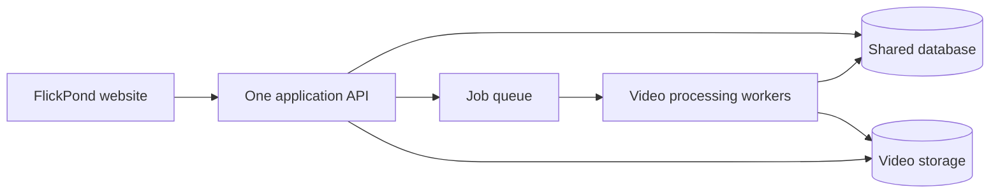
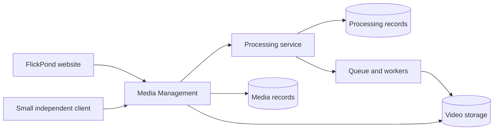

# Project 2 report drafting context

This handoff gives a fresh agent the context needed to draft Team 17's Project 2 report.
The user wants a Markdown draft first. Create the DOCX only after the user approves that draft.
The context reflects discussions and source inspection on 4 October 2026, in Singapore time.

## 1 Task and approval boundary

Create the first draft at:

`/Users/speedpowermac/Documents/projects/CODE_MAIN/NUS/dc2/docs/project-2-report-draft.md`

Follow the supplied Project 2 report template. Populate its sections with supported baseline facts and the proposed Project 2 design.
Label unimplemented work as planned. Use explicit placeholders for results, actual effort and decisions that need evidence.
The existing discussion does not establish completion of any Project 2 implementation.

Show the Markdown draft to the user for review. Incorporate requested revisions in that same file.
Wait for explicit user approval before creating:

`/Users/speedpowermac/Documents/projects/CODE_MAIN/NUS/dc2/docs/project-2-report.docx`

The user specifically requested a report draft in the latest message.
Earlier discussion focused on proposal approval. Do not silently replace the requested report with a proposal.
Keep the report consistent with the proposed scope. Explain the distinction briefly if it affects the draft.
Do not create a slide deck unless the user requests one.

## 2 Workspace rules

Workspace root:

`/Users/speedpowermac/Documents/projects/CODE_MAIN/NUS/dc2`

Read [AGENTS.md](/Users/speedpowermac/Documents/projects/CODE_MAIN/NUS/dc2/AGENTS.md).

- Put deliverables in the root folder or root `docs/` folder.
- Do not write report files inside `Media_player/`.
- Treat application code as read-only for this drafting task.
- Preserve existing local edits and untracked files.
- Use authenticated `gh` exclusively for all GitHub access.
- Do not use GitHub connectors, browser access or direct HTTP requests to GitHub.
- Do not deploy, change infrastructure or contact the professor as part of report drafting.

The user previously authorised baseline inspection, including reading `Media_player/`.
That authorisation does not require changes to the application for this document task.

Use the requested [asd-ste100 skill](/Users/speedpowermac/.codex/skills/asd-ste100/SKILL.md).
Use its default STE-flavored mode. Keep sentences short and preserve uncertainty.
Do not claim certified ASD-STE100 dictionary compliance.

## 3 Read these sources first

### Original course documents

1. [Project 2 briefing](</Users/speedpowermac/Documents/projects/CODE_MAIN/NUS/dc2/docs/reference/01 Briefing.pdf>)
   - Page 3: the three courses and DevSecOps.
   - Page 5: mandatory project characteristics and deliverables.
   - Pages 6-7: effort, schedule, team selection and submission.
   - Page 8: proposal content.
   - Page 9: questions about platform value, scale, cloud value, automation and feasibility.
   - Pages 12-14: assessment, peer assessment and progress reporting.

2. [Original Project 2 report template](</Users/speedpowermac/Documents/projects/CODE_MAIN/NUS/dc2/docs/reference/02 Project Report Template for Practice Project.docx>)
   - This file controls the report structure and later DOCX formatting.
   - It is a report template, not the Project 1 proposal.
   - Preserve its substantive sections and their order.
   - It explicitly permits different scopes for architecture, design and implementation.

3. [Presentation guidelines and schedule](</Users/speedpowermac/Documents/projects/CODE_MAIN/NUS/dc2/docs/reference/04 Project Presentation Guidelines & Schedule.pdf>)
   - Page 1: suggested presentation structure and demonstration expectations.
   - Page 2: Team 17's presentation slot.

### Current planning references

4. [Implemented baseline and proposed scope](/Users/speedpowermac/Documents/projects/CODE_MAIN/NUS/dc2/docs/project-2-baseline-and-plan.txt)
   - Main reference for the code inspection and smaller proposed commitments.
   - Its agentic time estimates are planning estimates, not actual effort.
   - The user's later instruction rejects a day-by-day narrative in the proposal or report.

5. [Requirements guide](/Users/speedpowermac/Documents/projects/CODE_MAIN/NUS/dc2/docs/project-2-requirements-and-scope.txt)
   - Useful for requirements and explanations.
   - Its original 30-person-day allocation does not describe the user's current agentic time constraint.

6. [Earlier proposal draft](/Users/speedpowermac/Documents/projects/CODE_MAIN/NUS/dc2/project-2-proposal-draft.txt)
   - Useful background, but it contains broader and older promises.
   - Do not copy its optional mechanisms into the new scope as firm commitments.
   - Its repeated requests for lecturer confirmation are now stale.

7. [Email draft](/Users/speedpowermac/Documents/projects/CODE_MAIN/NUS/dc2/project-2-proposal-email-draft.txt)
   - This records the questions subsequently answered by the professor.
   - Section 5 of this handoff summarises the actual reply.

### Secondary notes and Project 1 source

- [Briefing notes](/Users/speedpowermac/Documents/projects/CODE_MAIN/NUS/dc2/docs/briefing-notes.md)
- [Presentation notes](/Users/speedpowermac/Documents/projects/CODE_MAIN/NUS/dc2/docs/presentation-notes.md)
- [Older working interpretation](/Users/speedpowermac/Documents/projects/CODE_MAIN/NUS/dc2/docs/reference/report-template-notes.md)
- [Original Project 1 proposal](</Users/speedpowermac/Downloads/Project Proposal_Ibrahim.pdf>)

The file named `report-template-notes.md` contains an older working interpretation.
It does not faithfully reproduce the DOCX template's outline. Use the original DOCX for the report structure.
Some notes also say the team number or reuse approval is unknown. This handoff contains later information.
The reviewers found no original Project 1 proposal DOCX in the searched locations. The available original is the PDF.

Use originals for course requirements. Use the professor's reply for team exceptions and scope acceptance.
Use inspected code for implementation status. A proposal or roadmap does not prove implementation.

## 4 User intent and limits

The user wants enough work to demonstrate the certificate concepts through a focused project.
The user does not want an ambitious product expansion.
Use an 80/20 approach to baseline descriptions. Explain the basics without an exhaustive feature audit.

The maintainer estimated that the original team implemented about 60% of Project 1's planned features.
This is a qualitative progress estimate. The inspection did not calculate an exact percentage.
Do not wait for the original team to complete the remaining features.
Do not add those missing features to Project 2 merely because Project 1 promised them.

The user prefers at most three elapsed agentic days for coding.
This does not mean three person-days or three eight-hour working days.
Agents may perform independent work in parallel, but integration and deployment still impose dependencies.
Do not present the time limit as a delivery guarantee.

The user later requested a simple explanation without Day 1, Day 2 or Day 3 sections.
Use a rough task breakdown if the report needs one. Keep the internal time constraint separate from actual recorded effort.
DDD and service contracts precede coding. Collect test evidence during implementation.
Report and presentation drafting can follow the measured results.

## 5 Team and professor guidance

Certificate: Graduate Certificate in Architecting Scalable Systems.
Practice module: SWE5001, SE34FT, Sep-Nov 2026.
Team: 17.
Members:

- Guruprasath Gopal.
- Ibrahim Mammadov.
- Nguyễn Kim Long.

The members come from two Project 1 teams.
They selected FlickPond, from Ibrahim's original team, as the shared baseline.
The user supplied no external sponsor. Describe this as a team-proposed project unless the user supplies a sponsor.

Prof Boon Kui Heng approved the three-member team on 22 September 2026.
He created Team 17 in Canvas and asked the members to join it.
This is the exception to the briefing's normal four-to-five-member group guidance.

The user's email of 3 October 2026 proposed:

- Separate media management and processing with clear data ownership and independent deployment.
- Demonstrate reuse through FlickPond and a small second client.
- Demonstrate cloud deployment, scalability, recovery, security and deployment automation.

The email asked whether reuse was acceptable and whether search, moderation and analytics could remain outside Project 2.
The professor answered yes to both questions.
He required a clear definition of the new contribution.
He also required techniques from all three courses, including proper DDD for identifying and designing microservices.
His example includes refactoring the service design where necessary.

The reply's own date was not visible in the supplied correspondence.
Do not invent that date.
The reply accepts the general direction. It does not approve every implementation detail in the older draft.
Do not describe the entire detailed proposal as formally approved.

## 6 Course requirements beyond DDD

The user explicitly corrected an excessive emphasis on DDD.
DDD is one design technique. The project must demonstrate all three courses and DevSecOps.

| Area | Required focus | Proposed project evidence |
|---|---|---|
| Architecting Software Solutions | Business needs, architecture decisions, quality attributes, security, performance and capacity. | Trade-offs, quality scenarios, load measurements and failure behavior. |
| Platform Engineering | Reusable APIs, domain analysis, platform operations and data. | DDD, data ownership, contracts and the small independent client. |
| Cloud Native Solution Design | Appropriate cloud services and infrastructure for scalable solutions. | Logical and physical views, cloud deployment and adjustable worker capacity. |
| DevSecOps | Automated development, security checks and deployment. | Build, test, scan, deploy and smoke-test evidence. |

The supplied briefing does not enumerate every technique taught in class.
Do not invent a comprehensive course checklist. Use additional class materials only if the user supplies them.

The six mandatory project characteristics are:

1. Build a platform that supports a business ecosystem.
2. Demonstrate scalability.
3. Build a cloud native application using appropriate cloud services.
4. Script suitable development and deployment activities.
5. Implement the minimum security controls for the chosen scope.
6. Build at least one application that demonstrates the platform.

Required outputs include a working system, code repository or archive, report, pipeline scripts and test scripts.
The sources do not prescribe a service count, cloud provider, Kubernetes or autoscaling.
The second client is our proposed evidence of reuse. The course requires at least one application.

## 7 Inspected baseline and repository state

The original user-supplied main commit was:

`55667584aa3b4ec15fe2f305c5f7b5805f79069c`

Authenticated GitHub inspection on 4 October found a newer main:

`890c5ec5743fdc004cd0855b7ca73c6e325e1e3e`

That newer main added load-test scripts, reports and roadmap updates.
It did not implement the planned AWS migration, direct uploads or autoscaling.
Treat this commit as the inspected historical snapshot. Do not assume it remains current main indefinitely.

The read-only snapshot still exists at:

`/private/tmp/dc2-media-baseline-890c5ec`

Three GPT-6.1 Sol subagents inspected promises, implemented features and operations separately.
The parent agent inspected service coupling and GitHub CI results.
This review did not execute the application or fresh load tests.

The actual submodule remains at:

`/Users/speedpowermac/Documents/projects/CODE_MAIN/NUS/dc2/Media_player`

Its checked-out commit is `b042c86be860dad1dc1024df94849bcebbbf3795`.
It has a local edit to its proposal and several untracked files.
The earlier inspection preserved those files. It did not update the submodule checkout.

The snapshot has no Git history. Its pin comes from the authenticated archive request and GitHub comparison.
If the temporary snapshot disappears, obtain the pinned archive through `gh`.
Do not reset the user's working tree.

Repository identity: `Flickpond/Media_player`.
The existing application uses Python, FastAPI, PostgreSQL, Redis/RQ, MinIO, FFmpeg and a browser frontend.
Repository documentation and tracked reports describe hosting on Alibaba Cloud ECS with TLS at `https://flickpond.com`.
Do not treat that shared live deployment as an environment available for modification.
A fork copies code. It does not automatically copy cloud infrastructure, credentials, accounts or stored videos.

### Relevant paths inside the inspected snapshot

- `/private/tmp/dc2-media-baseline-890c5ec/README.md`
- `/private/tmp/dc2-media-baseline-890c5ec/CLAUDE.md`
- `/private/tmp/dc2-media-baseline-890c5ec/app/api/`
- `/private/tmp/dc2-media-baseline-890c5ec/app/models/`
- `/private/tmp/dc2-media-baseline-890c5ec/app/repositories/`
- `/private/tmp/dc2-media-baseline-890c5ec/app/worker/`
- `/private/tmp/dc2-media-baseline-890c5ec/frontend/app.js`
- `/private/tmp/dc2-media-baseline-890c5ec/tests/`
- `/private/tmp/dc2-media-baseline-890c5ec/docker-compose.yml`
- `/private/tmp/dc2-media-baseline-890c5ec/.github/workflows/ci.yml`
- `/private/tmp/dc2-media-baseline-890c5ec/.github/workflows/dast.yml`
- `/private/tmp/dc2-media-baseline-890c5ec/deploy/`
- `/private/tmp/dc2-media-baseline-890c5ec/load/`
- `/private/tmp/dc2-media-baseline-890c5ec/docs/contract.md`
- `/private/tmp/dc2-media-baseline-890c5ec/docs/load-test-cloud-20260929.md`
- `/private/tmp/dc2-media-baseline-890c5ec/docs/load-test-local-20260925.md`
- `/private/tmp/dc2-media-baseline-890c5ec/docs/roadmap.md`
- `/private/tmp/dc2-media-baseline-890c5ec/docs/sprint4-plan.md`

The roadmap and sprint plan describe future work. They are not implementation evidence.

## 8 What currently exists

| Capability | Inspected status and limits |
|---|---|
| Accounts and access | Registration, login, logout, expiring JWT cookies, password hashing and owner/operator checks exist. Profiles, password reset and email verification do not exist. |
| Upload | Authenticated multipart upload, input checks and a 100 MiB limit exist. Resumable upload, measured transfer progress and malware scanning do not exist. |
| Processing | FFmpeg, durable states, conditional claims and duplicate-delivery protection exist. The job states are `queued`, `processing`, `done` and `failed`. |
| Recovery | The reaper fails abandoned processing jobs and re-enqueues some queued jobs missing from RQ. This does not mean interrupted encodes resume automatically. |
| Retry | The API retries with the existing source. The browser retry instead uploads the remembered file again. |
| Playback | MP4 fallback and best-effort 360p/480p/720p HLS exist. This does not establish 4K or guaranteed HLS for every input. |
| Library | Personal job listing, pagination, status filters and deletion exist. Rich metadata and public discovery do not exist. |
| Editing | Backend crop, clip, scaling and conversion exist. Crop and clip widgets remain missing. Treat editing as inherited capability. |
| Moderation | Operators can list and delete jobs. Reports, review decisions, hide/restore and moderation audit history do not exist. |
| Sharing and external videos | Public/Unlisted/Private modes and YouTube reference integration do not exist. |
| Product analytics | View counts, engagement metrics and product analytics do not exist. Operational metrics serve a different purpose. |
| Delivery | Compose, cloud hosting, TLS, tests, CI and scans exist. Deployment remains operator-driven. Autoscaling and Terraform do not exist. |

The existing API, workers and reaper share job models and persistence contracts.
Multiple containers already exist. They do not establish independent business-service data ownership.
Authentication currently queries the shared users table. The job model has a foreign key to that table.
The proposed extraction therefore needs an explicit boundary and persistence design.

## 9 Evidence and its limits

The tracked September cloud report records successful upload, processing and HLS playback.
At 50 users, completed-job reads had p90 latency of 660 ms and no request failures.
Login p90 was 5.8 seconds. The broad two-second non-video criterion did not pass.
The separate browser check recorded the first HLS frame in about 442 ms.
These checks mainly read one completed video. They do not prove concurrent processing scalability.
Raw load reports were absent from the inspected snapshot.

At inspected main, GitHub CI passed unit tests, frontend tests, integration tests and the image build.
The container scan failed on one fixable HIGH package vulnerability.
Sonar analysis and ZAP findings are report-only in the inspected workflows.
Do not claim all security gates passed or that deployment automatically requires their success.

Historical CI references:

- Current inspected main: `https://github.com/Flickpond/Media_player/actions/runs/37186820699`
- Requested baseline CI: `https://github.com/Flickpond/Media_player/actions/runs/36380917282`
- Requested baseline DAST: `https://github.com/Flickpond/Media_player/actions/runs/36403815655`

The requested baseline's CI and DAST passed. Newer findings still apply despite those historical passes.
Normal Compose has a documented problem with the pinned MinIO image on fresh machines.
CI has a source-build alternative. Treat reproducible setup and scan remediation as planned prerequisites.

Use these values only as inherited observations with dates and scope.
Leave Project 2 results blank until its deployed revision produces new evidence.

## 10 Proposed Project 2 direction

Working title: FlickPond reusable cloud media processing platform.
The user discussed this direction but did not approve every detailed implementation mechanism.
Describe the following as proposed Project 2 work.

Business problem:
Small content teams repeatedly build upload, processing, storage and access controls for each application.
A reusable platform provides those capabilities through stable APIs.

Participants:

- Seed: an owned video asset linked to a processing job.
- Producers: content owners who submit media through applications.
- Consumers: authorised viewers who access processed media through applications.
- Integrators: developers who reuse the platform APIs.
- Operators: people who inspect job health and failures.

### Four proposed commitments

1. **Apply domain analysis and implement a justified service boundary.**
   Media Management handles accounts, access, uploads and a minimal source-asset record.
   Processing owns jobs, state transitions, outputs, workers and recovery.
   Define contracts, exclusive data ownership and independent deployment.
   Check these candidate boundaries with DDD before finalising the design.

2. **Demonstrate platform reuse.**
   Retain FlickPond as the main application.
   Add one small client that authenticates, uploads, checks status and accesses an authorised result.
   The client uses APIs without database access or application-internal imports.

3. **Adapt security and automated delivery.**
   Authenticate internal calls and preserve ownership checks.
   Reuse the existing processing state machine and recovery task.
   Script versioned cloud deployment with health checks and an upload-to-playback smoke test.
   Address reproducible setup and scan findings under a documented policy.

4. **Measure the design.**
   Compare one worker with two workers using the same workload and recorded resources.
   Measure throughput, queue wait and failures.
   Record interruption, retry, API latency, playback and client integration effort.

An AWS migration is optional. The existing cloud approach can inform the demonstration environment.
No final provider, account, instance size or deployment budget was chosen in this discussion.
Mark those details as decisions pending.
Separate cloud hosting from demonstrated cloud-native benefits.
Explain selected infrastructure, independent worker capacity, recovery and automation.

### Simple architecture views

Label both diagrams clearly. The first shows the inherited system. The second shows a proposed design.
Do not present the second diagram as deployed.





These diagrams are deliberately simple. Add physical and persistence views where the report template requires them.
Separate logical data ownership does not necessarily require separate physical database servers.
Separate credentials and migrations must enforce the chosen ownership boundary.

### Scope exclusions

Keep these outside firm commitments:

- Completion of the remaining Project 1 feature list.
- Search, public discovery, moderation workflows and product analytics.
- External videos, sharing modes, billing and multi-tenancy.
- Crop/clip UI completion, thumbnails, 4K and editor redesign.
- Direct/resumable upload and larger upload limits.
- AWS migration, Terraform, Kubernetes and autoscaling.
- Historical data migration and a new token algorithm with complete key rotation.
- Host or availability-zone failure recovery.

A new transactional outbox is not mandatory if inherited reconciliation meets the chosen recovery criteria.
Reliable job tracking, bounded failure behavior and ownership checks remain necessary.
Use fresh demonstration data to avoid an unnecessary historical migration.
Manual worker scaling does not prove autoscaling. Worker recovery does not prove host resilience.

## 11 Report structure to follow

Use the supplied DOCX as the structural authority. Its substantive outline is:

```text
Title page with project, certificate, Team 17 and members
Contents
1 Introduction
  1.1 Background
  1.2 Business Needs
  1.3 Stakeholders
  1.4 Project Scope
    1.4.1 Functionality in scope
    1.4.2 Functionality out of scope
2 Project Conduct
  2.1 Project Plan
  2.2 Project Status
  2.3 Project Metrics
3 Solution Overview
  3.1 Logical Architecture & Design
    3.1.1 Key Architectural Decisions
    3.1.2 Tiers and Layers
    3.1.3 Nodes and Subsystems
    3.1.4 Platform Design
  3.2 Physical Architecture & Design
    3.2.1 Key Architectural Decisions
    3.2.2 Technology and Services
    3.2.3 Persistence Design
    3.2.4 Detailed Design
  3.3 Other Architectural Decisions
  3.4 Architectural Limitation
4 Quality Attributes
  4.1 Performance
  4.2 Availability
  4.3 Security
  4.4 Extensibility and Maintainability
5 DevOps and Development Lifecycle
  5.1 Source Control Strategy
  5.2 Continuous Integration
  5.3 Continuous Delivery
6 Other things to be highlighted
```

Use the final optional section only for relevant additional material.
Do not fill it with invented findings.
Adapt the tiers/layers explanation to the chosen architecture, as the template permits.
Keep decision identifiers unique across the report.

Suggested content placement:

- Introduction: business need, participants, inherited baseline and focused scope.
- Project Conduct: estimated tasks, current planning status and placeholders for actual milestones and member effort.
- Logical Design: candidate domain model, service responsibilities, contracts, producer/consumer interactions and trade-offs.
- Physical Design: planned environment, network access, data isolation, storage and representative workflow.
- Quality Attributes: measurable scenarios, planned checks, inherited observations and placeholders for Project 2 results.
- DevOps: inherited pipeline, proposed adaptation, deployment checks and source/artifact management.
- Limitations: single-host constraints, incomplete baseline features and decisions still pending.

Compare retaining the modular monolith with extracting Processing and with a larger service split.
Explain the chosen trade-off. Avoid implying that more services automatically improve the system.
DDD should support the domain model and boundaries. It should not dominate the entire report.

## 12 Claim discipline and placeholders

Keep four statuses distinct:

- **Inherited implementation:** code exists in the inspected baseline.
- **Inherited observation:** a dated report or CI run records a result.
- **Planned Project 2 work:** proposed design or implementation.
- **Pending evidence:** a result or decision the team must supply later.

Use explicit placeholders such as:

```text
[DECISION PENDING: cloud provider, environment and budget]
[RESULT PENDING: one-worker and two-worker processing measurements]
[RESULT PENDING: interruption and retry outcome]
[EVIDENCE PENDING: Project 2 pipeline and deployed revision]
[ACTUAL EFFORT PENDING: hours recorded by each member]
```

Do not fabricate targets, throughput gains, test passes, screenshots, deployment URLs or team contributions.
Select numeric acceptance targets before final acceptance tests. Do not choose them retrospectively from results.
Do not promise twice the throughput or copy the broad Project 1 latency target as a passed Project 2 result.
Approval of report wording does not establish implementation or measured outcomes.

## 13 Proposal and presentation formats

The proposal requirements differ from the report structure.
Briefing page 8 asks for title, sponsor if applicable, members, overview, general architecture, scope and rough effort.
A logical architecture is sufficient at proposal stage.
The supplied briefing prescribes no proposal slide deck, slide count or visual template.
The previous agent recommended adapting the GC1 proposal format to these requirements.
That was a recommendation, not explicit lecturer approval of a template.

The final presentation has a separate suggested outline:

1. Overview.
2. Project Conduct.
3. Logical Architecture and Design.
4. Physical Architecture and Design.
5. DevOps and Development Lifecycle.
6. Demonstration.

Its total slot is 40 minutes, including questions. The source suggests timings and gives no specified slide count.
Do not use the presentation outline as a substitute for the report template.

## 14 Dates and assessment context

Use Singapore time. These dates come from the supplied documents, not a fresh Canvas check.

- 4 October 2026: proposal submission and team registration.
- 7 October: lecturer proposal review.
- 8-20 October: main project work and consultation.
- 26 October, 14:35-15:15: Team 17 presentation.
- 2-6 November: tentative written-exam period.
- 16 November: report submission, including presentation feedback.

Submit progress reports fortnightly to PM Progress Reports in Canvas.
Include completed work, hours per member, problems and the next two weeks' tasks.
The proposal assignment is PM Project Proposals.
Do not invent exact submission times or assert that no schedule changes occurred.

The briefing assigns 50% to the project and 50% to the exam.
Each component requires at least 40%. The overall certificate score requires at least 50%.
Peer assessment requires unique ranks by its deadline.
These facts provide context. They need not occupy the project report unless relevant.

## 15 DOCX conversion after approval

The approval requirement comes directly from the user.
Create only the Markdown draft during the first stage.
After explicit approval, convert the approved content into a copy of the original report template.
Preserve the source template.

Read the [documents skill](/Users/speedpowermac/.codex/plugins/cache/openai-primary-runtime/documents/26.905.11957/skills/documents/SKILL.md).
Follow its template workflow and document authoring instructions.
Resolve bundled dependencies through `mcp__codex_app__load_workspace_dependencies`.
Preserve the template's heading hierarchy, styles, tables and report structure.
Render Mermaid diagrams into suitable document figures. Do not leave raw Mermaid code in the DOCX.
Render the DOCX with the skill's renderer.
Inspect every rendered page and address layout defects before delivery.
Do not overwrite the supplied template or invent evidence during conversion.

## 16 First actions for the fresh agent

1. Read this handoff and the original course documents.
2. Read the current baseline-and-plan file.
3. Check relevant baseline source only where the draft needs support.
4. Create the Markdown report draft following the supplied template.
5. Check coverage of all three courses and DevSecOps.
6. Check the distinction between inherited facts, planned work and pending evidence.
7. Present the Markdown draft and its substantive unresolved decisions.
8. Wait for user approval before DOCX conversion.

Do not repeat the full repository audit. Do not expand implementation scope to fill template headings.
Produce a useful draft with honest placeholders where the evidence does not yet exist.
