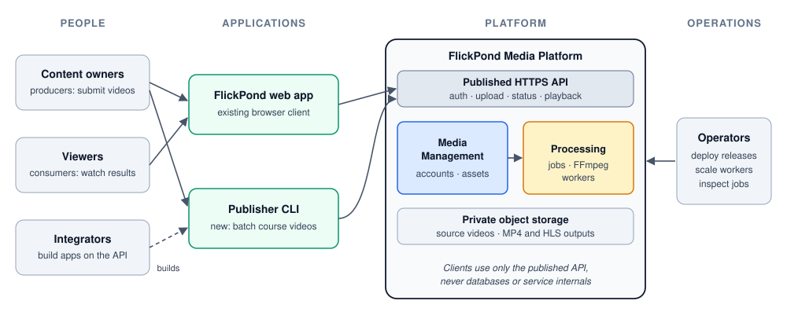
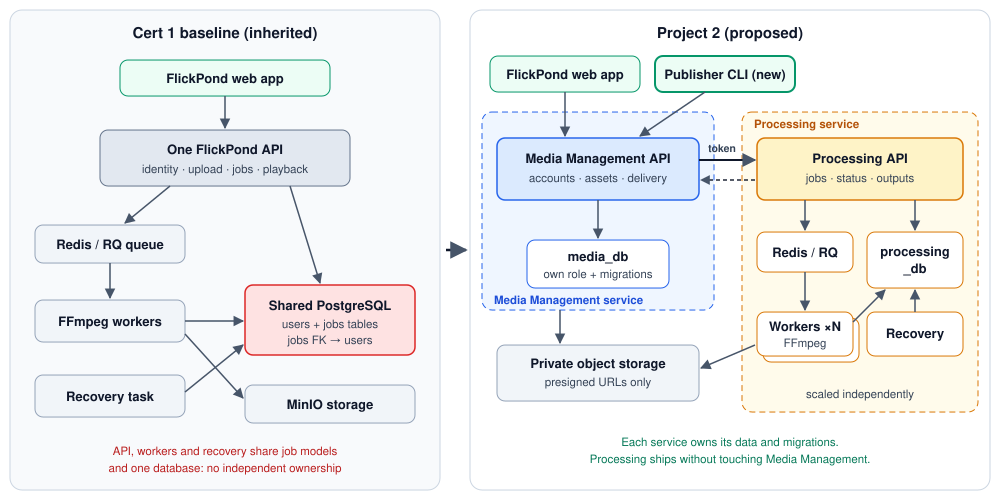
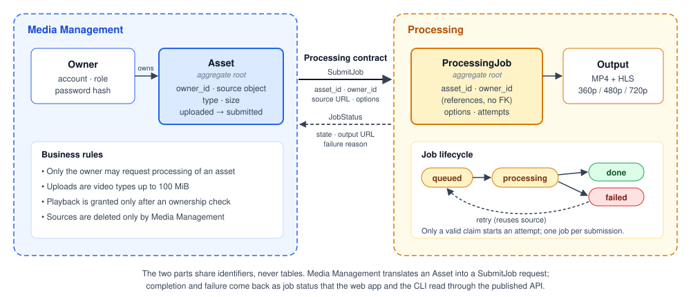
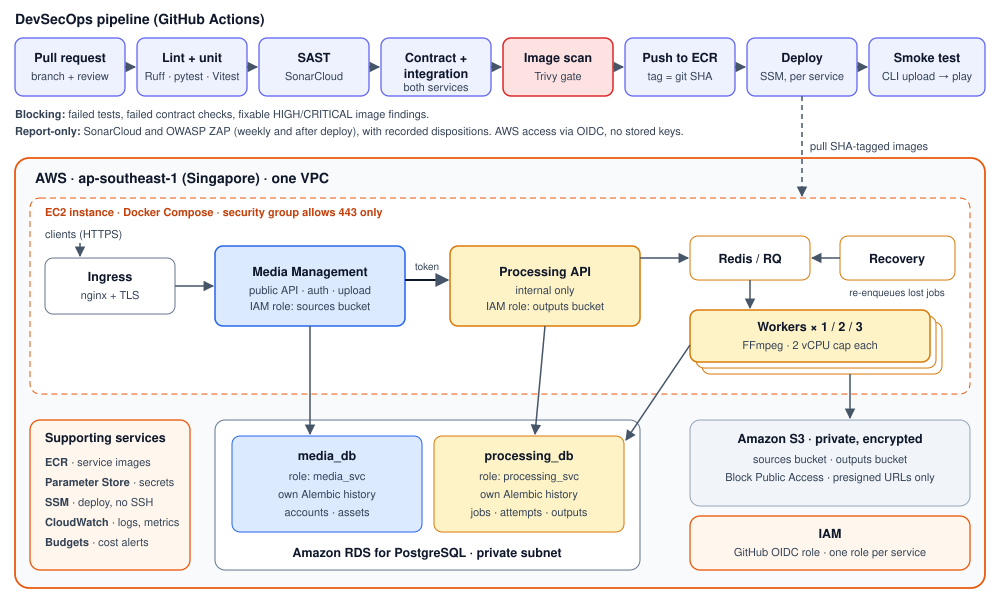

# FlickPond: A Reusable Cloud Media Processing Platform

**Project Proposal — SWE5001 Architecting Scalable Systems Practice Module (SE34FT, Sep–Nov 2026)**

| | |
| ------------ | ------------------------------------ |
| **Project title** | FlickPond: A Reusable Cloud Media Processing Platform |
| **Project sponsor** | Team-proposed project (no external sponsor) |
| **Team** | Team 17 |
| **Project members** | Guruprasath Gopal · Ibrahim Mammadov · Nguyễn Kim Long |
| **Submission date** | 4 October 2026 |

Team 17 combines members from two Project 1 teams. Prof Boon Kui Heng approved the three-member team on 22 September 2026. He also accepted that we reuse FlickPond, the Project 1 system built by Ibrahim's original team, and that search, moderation and analytics stay outside Project 2.

---

## 1 Overview

### 1.1 Context

FlickPond is a video application built in Project 1. Users register, upload their own videos, and FlickPond converts each upload into MP4 and adaptive HLS streams (360p, 480p and 720p) with FFmpeg workers. Owners then follow the job status and play the result through a signed, owner-checked link. The system runs on FastAPI, PostgreSQL, Redis with RQ, MinIO object storage, nginx and a browser frontend, deployed with TLS on a single cloud virtual machine.

FlickPond works, but it is built as **one application**. A single API handles identity, uploads, jobs and playback. The API, the workers and the recovery task share the same job models and one database, and the jobs table has a foreign key to the users table. Another product cannot reuse the video workflow without importing FlickPond's code or reading its database.

Project 2 uses the frozen Project 1 code as its baseline: repository `Flickpond/Media_player`, commit `890c5ec`. We do not depend on any future Project 1 feature work.

### 1.2 Business problem

Small content teams such as training providers, course teams, small studios and community publishers keep needing the same video capabilities:

- secure upload of owned videos,
- conversion into formats that play well on any device,
- visibility of processing progress and failures,
- playback restricted to authorised viewers.

Today each application rebuilds these capabilities, or copies and modifies another team's code. This duplicates work and leads to inconsistent security and operations. There is also a capacity problem: video transcoding is CPU-heavy and bursty. When it shares a deployment unit with the user-facing API, a backlog of uploads competes with logins and status checks.

### 1.3 What the platform provides

We will turn FlickPond into a **media processing platform**. Applications will use one documented API for the full workflow: upload, process, track and play. They will not need to know how storage, queues or FFmpeg work. The platform offers three benefits:

1. **Reuse.** A new application gets authenticated upload, processing, status and authorised playback by calling the published API. It needs no copied code and no database access.
2. **Independent capacity.** Processing is its own service, so operators can add or remove workers to match the backlog without scaling or redeploying the user-facing API.
3. **Repeatable, secure releases.** Every change passes automated tests and security gates. Each service is then deployed separately from versioned images and checked by an automated end-to-end smoke test.

We will demonstrate reuse with two applications. The first is the existing **FlickPond web app**. The second is a new **Publisher CLI**, a command-line tool that a course team could use to bulk-publish lecture recordings.

### 1.4 What is new in Project 2

| Area | Inherited from Project 1 | New in Project 2 |
| --- | --- | --- |
| Service structure | One API; workers and recovery task share its job code | **Separate Media Management and Processing services**, found through domain analysis and connected by an authenticated contract |
| Data ownership | One shared database; jobs reference the users table | **Each service owns its data and migrations**, enforced with separate database roles; services share identifiers, not tables |
| Reuse | One browser application | **Second, independent client** (Publisher CLI) that uses only the published API |
| Security | Login, owner checks, TLS, signed output links, CI scans | **Service-to-service authentication**, owner checks inside Processing, least-privilege storage access through presigned URLs, and boundary security tests |
| Delivery | Tests and scans in CI; manual, operator-driven deployment | **Scripted per-service deployment** of versioned images, health checks and an automated upload-to-playback smoke test |
| Evidence | Load tests that mainly read one completed video | **New experiments**: processing throughput with 1, 2 and 3 workers, recovery from failures, API latency after the split, and integration effort for a new client |

FFmpeg processing, HLS output, worker replicas and the basic CI workflow are inherited capabilities. We will reuse them but do not claim them as Project 2 contributions.

---

## 2 General Architecture

### 2.1 Platform context

*Figure 1. Who uses the platform. Applications use only the published API. Operators deploy releases and scale processing.*

### 2.2 From one application to two services

*Figure 2. Left: the inherited Project 1 structure. Right: the proposed structure, with Media Management and Processing as separately owned and separately deployed services.*

**Media Management** is the platform's front door. It handles accounts and login, upload checks, source-asset records, and delivery of playback links after an ownership check. Both applications call only this service.

**Processing** owns everything about turning a source into playable output: processing jobs and their state, the queue, the FFmpeg workers, output records, and the recovery task. It is reachable only on the private network and only with a service token.

### 2.3 Finding the service boundary

We drew the boundary from the business workflow rather than from the existing code layout. We followed the language used at each step (*upload*, *submit*, *claim*, *encode*, *complete*, *play*) and grouped together the concepts that share rules and change together. The four initial candidates were Identity, Media, Processing and Delivery.

- **Identity, Media and Delivery combine into Media Management.** Every playback decision needs the owner and the asset, and these concepts change at the same pace as the user-facing product.
- **Processing stands alone.** It has its own lifecycle (`queued → processing → done | failed`) and its own consistency rule: only a valid claim may start an attempt. It runs asynchronously and has a very different resource profile, mostly CPU and scaled by worker count.

*Figure 3. Each service has its own model and business rules. **Asset** and **ProcessingJob** are each a consistency boundary (an aggregate). Processing keeps owner and asset identifiers as plain references, with no foreign keys across services. Media Management translates its Asset into a SubmitJob request, so neither service depends on the other's internal model.*

The contract is small and versioned:

| Operation | Caller → service | Purpose | Key rules |
| --- | --- | --- | --- |
| Log in / log out | Client → Media Management | Session (JWT cookie or bearer token for the CLI) | Existing password hashing and token expiry |
| Upload asset | Client → Media Management | Store the source and request processing | Video types only, ≤ 100 MiB, caller becomes owner |
| Get asset / list assets | Client → Media Management | Status and playback link | Owner-only; the playback link is a short-lived presigned URL |
| Retry asset | Client → Media Management | Re-run a failed job | Reuses the stored source; no re-upload |
| `SubmitJob` | Media Management → Processing | Create a job for an asset | Service token required; **idempotent on `asset_id`**, so a repeated call returns the existing job |
| `GetJob` / `ListJobs` | Media Management → Processing | Job state, failure reason and output reference | Every query is filtered by the forwarded owner identity |
| `RetryJob` | Media Management → Processing | Re-queue a failed job | Allowed only from `failed`; attempts are recorded |

Exact paths and schemas will be published as OpenAPI documents and checked by contract tests in the pipeline. Media Management keeps the routes the FlickPond web app already uses, so the frontend needs only small changes.

### 2.4 Key architectural decisions

| ID | Decision | Rationale | Alternative considered |
| --- | ---------- | ---------- | ---------- |
| AD-01 | Extract **Processing** as the only new service | It has distinct rules, lifecycle and scaling needs, which gives the most value per unit of effort | Keep the modular monolith (shared data blocks independent ownership); split into four services (more contracts and operations than the business need justifies) |
| AD-02 | **Database per service** on one PostgreSQL server: separate databases, roles and migration histories | Real ownership boundary at low cost; either role is refused access to the other's tables | Separate database servers: more cost, little extra value at our scale |
| AD-03 | **Synchronous submit, asynchronous processing**: the REST call creates the job; the queue drives the work | Keeps the existing Redis/RQ workers and gives clients an immediate job reference | New event broker: adds operations without a demonstrated need |
| AD-04 | **Idempotent `SubmitJob` keyed on `asset_id`** plus the existing reconciliation task | Makes retries across the boundary safe without a distributed transaction or an outbox | Transactional outbox: added only if experiments show reconciliation is not enough |
| AD-05 | **Presigned URLs** for source reads and output delivery | Workers never hold Media Management's storage credentials; viewers get time-limited access | Shared storage credentials across services |
| AD-06 | **Service token + forwarded owner identity** for internal calls, on a private network | Simple and testable; Processing still enforces ownership itself | Mutual TLS: stronger, but too much certificate work for a two-service demonstration |
| AD-07 | **Host on AWS using containers, in one small environment** | Containers already exist from Project 1; one environment keeps cost and operations low. Exact AWS services are confirmed in week 1 | Kubernetes or a multi-environment setup: more operational work than the project needs |
| AD-08 | **Fresh demonstration data** | Avoids migrating historical accounts and videos, and keeps effort on the contribution | Migrating Project 1 data |

### 2.5 Deployment and delivery

*Figure 4. Every change goes through an automated pipeline before it is deployed to AWS. Only HTTPS is public; the databases and storage are private.*

The platform will run on **AWS**. We commit to the following, and will choose the specific AWS services during week 1:

- Both services and the workers run as containers, and each service can be deployed on its own.
- Each service has its own database; media files are kept in private object storage.
- Only HTTPS is exposed to the internet, and secrets are kept out of the code.
- An automated pipeline builds, tests and scans every change, deploys it, and runs an upload-to-playback smoke test.

The same containers also run on a developer machine, so every scenario can be tried locally before it runs on AWS.

---

## 3 Scope of Work

### 3.1 Platform components

| Role | Who or what | In this project |
| --- | --- | --- |
| **Seed** | An owned video asset and its processing job | Upload, process, track, retry and play |
| **Producers** | Content owners submitting videos | Through the FlickPond web app (one at a time) and the Publisher CLI (batch) |
| **Consumers** | Authorised viewers | Play MP4/HLS output through presigned, owner-checked links |
| **Integrators** | Developers building new applications | Use the OpenAPI contract and the CLI as a reference client |
| **Operators** | The team as platform operators | Deploy per service, scale workers, inspect jobs and failures |

### 3.2 Use cases in scope

| ID | Use case | Applications |
| ------ | ------------------------------------------ | ---------- |
| UC-1 | Register, log in and upload an owned video | Web app, CLI |
| UC-2 | Process the video into MP4 and HLS (360p/480p/720p), with HLS as best effort | Platform |
| UC-3 | Track job status and play the processed result | Web app, CLI |
| UC-4 | Retry a failed job using the stored source | Web app, CLI |
| UC-5 | Bulk-publish a folder of videos and report the results | CLI |
| UC-6 | Scale processing workers without touching Media Management | Operator |
| UC-7 | Release a new Processing version on its own, with smoke test and rollback to the previous image | Operator / pipeline |

**Core workflow.** (1) The client uploads a video to Media Management. (2) Media Management checks the type, size and owner, stores the source privately and records the asset. (3) It calls `SubmitJob` with the asset ID, the owner ID and a presigned source URL. (4) Processing records a `queued` job and enqueues it. (5) A worker claims the job, encodes the video and writes the outputs. (6) The client polls status through Media Management, which asks Processing on the owner's behalf. (7) Once the job is `done`, the client receives a short-lived playback URL.

### 3.3 How the implementation demonstrates the course areas

**Scalability and performance.** Processing capacity scales by adding workers, independently of the API. We will process a fixed backlog of identical clips with 1, 2 and 3 workers, each capped at 2 vCPU, and record:

- jobs per minute,
- queue wait,
- processing time,
- failures,
- CPU and memory use.

FFmpeg uses every core it can find, so the CPU caps make the comparison fair: one uncapped worker would already saturate the host and hide any gain. We will also rerun Locust load tests on the status and playback routes after the split, and measure login separately.

**Cloud-native design.**

- Services are packaged as versioned containers.
- APIs and workers are stateless; durable state lives in the databases and object storage.
- Configuration and secrets are kept outside the code.
- Health checks drive the deployment.
- Workers are disposable: interrupted jobs are reconciled rather than lost.
- Each service is released independently, with no change to the other service.

**Platform engineering.**

- One published, versioned API covers the whole video workflow, documented with OpenAPI.
- Each service owns its data and migrations.
- Contract tests protect integrators from breaking changes.
- A second application is built with **no imports from service code and no database credentials**. We record its effort and size as evidence of reuse.

**DevSecOps.**

- We extend the existing GitHub Actions pipeline, which already runs linting, unit and integration tests, static analysis (SonarCloud), an image scan (Trivy) and a dynamic scan (OWASP ZAP), to cover both services and add contract tests.
- Failed tests and fixable HIGH or CRITICAL image findings block a release.
- A deploy step releases each service to AWS, then the CLI runs an upload-to-playback smoke test.
- We will fix the known fixable HIGH finding in the inherited image in week 1.

**Security controls and tests.**

| Control | Verified by |
| --- | --- |
| Public routes require a valid session; the uploader becomes the owner | Unauthenticated requests are rejected |
| Owner checks in Media Management **and** Processing | User A cannot read, retry or play User B's assets |
| Internal API requires a service token and is not publicly routed | Forged and token-less internal calls are rejected; the port is unreachable from outside |
| Separate database roles | Each service's credentials are refused on the other's database |
| Presigned, time-limited storage URLs; private storage | Expired and tampered URLs fail; no public listing of stored files |
| Input checks on type and 100 MiB size | Invalid and oversized uploads are rejected |
| Only HTTPS is public; databases, queue and storage are private | External port scan |
| Secrets kept out of git and images | Secret scanning in the pipeline |

**Availability and recovery.** Durable job states, conditional claims and the reconciliation task make failures visible and recoverable. We will test three failure cases:

- killing a worker during an encode,
- losing a queue entry after the job is committed,
- a temporary Processing outage while Media Management is accepting uploads.

### 3.4 Quality scenarios and initial targets

These targets are our starting commitments. After a short baseline run in week 2, we may adjust them, but only before the final tests, and we will report the results against the targets whether they pass or fail.

| Quality attribute | Scenario | Initial target |
| --- | --- | --- |
| Scalability | Fixed backlog of 30 identical 60-second 720p clips; 1 → 2 → 3 workers at 2 vCPU each | 2 workers ≥ 1.6× and 3 workers ≥ 2.1× the jobs/minute of 1 worker; median queue wait falls at each step; 0 failed jobs |
| Performance | 50 concurrent users polling status for 3 minutes | p90 ≤ 700 ms, < 1% errors (Project 1 measured 660 ms p90 for comparable reads before the split) |
| Performance | 20 concurrent logins, measured separately | p90 < 2 s |
| Availability | Worker killed mid-encode | Job is re-queued or marked `failed` within 5 min; a retry succeeds; no duplicate outputs |
| Availability | Queue entry lost after the job is committed | Reconciler re-enqueues the job within 2 min |
| Deployability | Release a new Processing version on its own | Deployed and smoke-tested in ≤ 10 min; Media Management container and `media_db` migrations unchanged |
| Security | Negative tests in §3.3 | 100% rejected; 0 fixable HIGH/CRITICAL image findings at release |
| Reusability | Publisher CLI built against the published API | 0 imports from service code, 0 database credentials; built within 2 person-days |

### 3.5 Out of scope

- The remaining Project 1 feature list (profiles, password reset, titles and tags, sharing modes, external videos).
- Search, public discovery, moderation workflows and product analytics.
- Crop/clip editor UI, thumbnails, 4K output, and direct or resumable uploads above 100 MiB.
- Kubernetes, autoscaling, and multi-zone or multi-region failover.
- Historical data migration, malware scanning and full key rotation.

### 3.6 How this proposal answers the briefing's key questions

| Question | Our answer |
| --- | --- |
| Which ecosystem pain point is solved? | Every content application rebuilding secure upload, processing and playback (§1.2) |
| Which common services does the platform provide? | Identity and ownership, asset intake, processing jobs, output delivery, and a reference client (§2.2, §2.3) |
| What does a new use case gain over building from scratch? | The full workflow, its security controls and its scaling through one API. Shown by the Publisher CLI and its recorded effort (§3.3) |
| What scale can it support, and how is that proven? | Throughput grows with workers until the CPU limit. Proven by the 1/2/3-worker experiment and the API load tests (§3.4) |
| How are benefits measured? | The quality scenarios and targets in §3.4, reported against raw results |
| What value does the cloud-native design add? | Independent release and scaling, disposable workers with recoverable state, and automated, gated delivery (§2.5, §3.3) |

---

## 4 Effort Estimates and Plan

### 4.1 Work breakdown

The briefing expects about 10 person-days per participant. Our estimate is **31 person-days** for three members.

| # | Work package | Lead | Person-days |
| ---- | ------------------------------------------ | -------------- | -------: |
| 1 | Freeze baseline, reproducible local setup, fix the inherited scan finding | Guruprasath | 2 |
| 2 | Domain analysis, service contracts and OpenAPI documents | Long (team review) | 3 |
| 3 | Extract Processing: service, own database and migrations, workers and recovery task | Ibrahim | 6 |
| 4 | Adapt Media Management: asset records, Processing client, web app routes and retry | Ibrahim | 3 |
| 5 | Boundary security: service token, owner checks, database roles, presigned URLs, negative tests | Guruprasath | 3 |
| 6 | Publisher CLI and contract tests | Long | 2 |
| 7 | AWS environment, per-service deployment, pipeline updates, smoke test | Guruprasath | 4 |
| 8 | Experiments: scaling, load, recovery and playback; raw results | Long | 3 |
| 9 | Integration fixes and repeat checks | All | 2 |
| 10 | Progress reports, presentation and final report | All | 3 |
| | **Total** | | **31** |

The resulting split is about 10 person-days for each member.

### 4.2 Schedule

| Period | Milestone |
| ---------- | -------------------------------------------- |
| 4 Oct | Proposal submitted |
| 5–7 Oct | Baseline frozen and reproducible; domain model and contracts drafted; lecturer review on 7 Oct |
| 8–14 Oct | Processing extracted with its own data; web app working end to end across the boundary; CLI started; first progress report |
| 15–20 Oct | Security controls and tests; AWS deployment and pipeline; baseline run, then final experiments |
| 21–25 Oct | Fixes, demonstration rehearsal and presentation preparation |
| 26 Oct, 14:35–15:15 | Team 17 presentation |
| 27 Oct–16 Nov | Final report, including presentation feedback; second progress report |

### 4.3 Main risks

| Risk | Impact | Mitigation |
| --- | --- | --- |
| Shared job and identity code is more tangled than expected | Delays the extraction | Do the extraction first; reach one working upload-to-playback flow before any other work |
| AWS account or cost issues | Late experiments | Set up the AWS account in week 1; cost alerts; the same stack runs locally |
| Scaling shows little gain | Weak scalability evidence | CPU caps per worker; profile the bottleneck and report it honestly |
| Three-member team | Less capacity than a 4–5 member team | Narrow scope, no new product features, clear ownership per work package |

### 4.4 Assumptions

- The team has an AWS account ready in week 1.
- The frozen Project 1 baseline is used as is. Missing Project 1 features are not completed.
- All demonstration data is new test content owned by the team.
