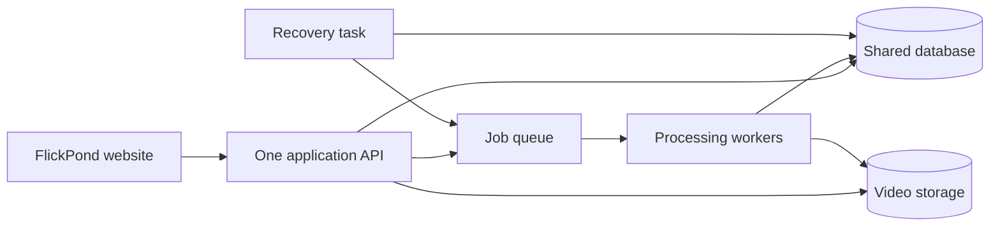
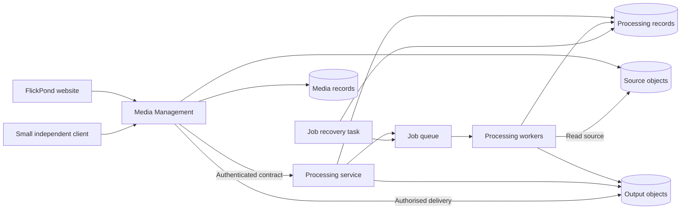
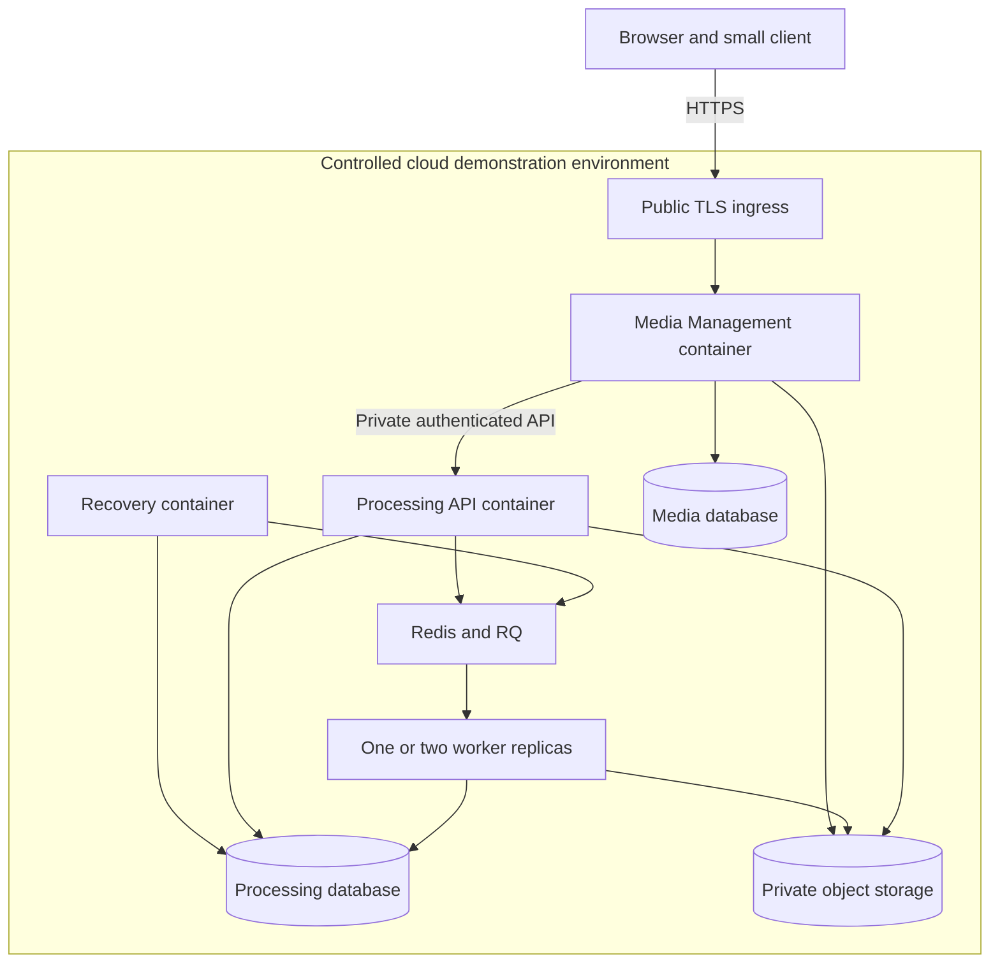
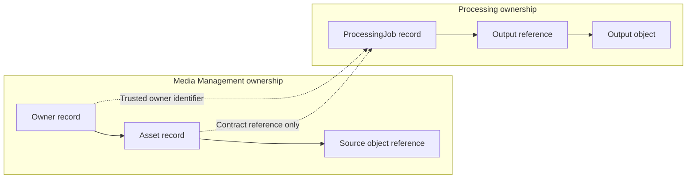
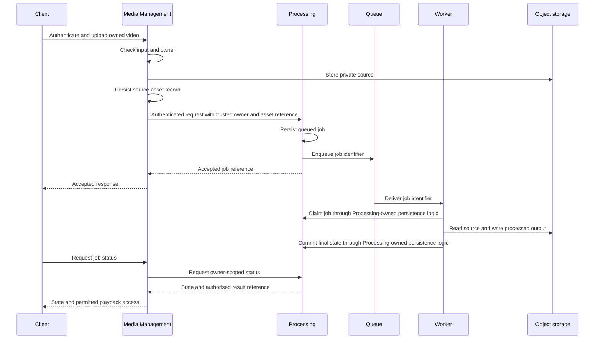

# Project Report for FlickPond Reusable Cloud Media Processing Platform

Practice Module for Graduate Certificate in Architecting Scalable Systems

SWE5001, SE34FT, Sep-Nov 2026

Team 17

Members:

- Guruprasath Gopal.
- Ibrahim Mammadov.
- Nguyễn Kim Long.

Draft date: 4 October 2026, Singapore time.

Project sponsor: team-proposed project.

**Report status:** This draft describes the inherited baseline and proposed Project 2 work. It does not establish completion of Project 2 implementation.

The report uses four status labels:

| Label | Meaning |
| --- | --- |
| **Inherited implementation** | Code exists in the inspected Project 1 baseline. This label does not establish a fresh runtime test. |
| **Inherited observation** | A dated report or historical CI inspection records a result. The result applies only to its stated conditions. |
| **Planned Project 2 work** | The team proposes the design, implementation, or test. Completion remains unconfirmed. |
| **Pending evidence** | The report needs a decision, measurement, artifact, or actual effort record. |

Source identifiers refer to the references in Section 6.3. Approval of this draft concerns the report wording. It does not establish implementation or test results.

## Contents

- 1 Introduction
  - 1.1 Background
  - 1.2 Business Needs
  - 1.3 Stakeholders
  - 1.4 Project Scope
    - 1.4.1 Functionality in scope
    - 1.4.2 Functionality out of scope
- 2 Project Conduct
  - 2.1 Project Plan
  - 2.2 Project Status
  - 2.3 Project Metrics
- 3 Solution Overview
  - 3.1 Logical Architecture & Design
    - 3.1.1 Key Architectural Decisions
    - 3.1.2 Tiers and Layers
    - 3.1.3 Nodes and Subsystems
    - 3.1.4 Platform Design
  - 3.2 Physical Architecture & Design
    - 3.2.1 Key Architectural Decisions
    - 3.2.2 Technology and Services
    - 3.2.3 Persistence Design
    - 3.2.4 Detailed Design
  - 3.3 Other Architectural Decisions
  - 3.4 Architectural Limitation
- 4 Quality Attributes
  - 4.1 Performance
  - 4.2 Availability
  - 4.3 Security
  - 4.4 Extensibility and Maintainability
- 5 DevOps and Development Lifecycle
  - 5.1 Source Control Strategy
  - 5.2 Continuous Integration
  - 5.3 Continuous Delivery
- 6 Other things to be highlighted
  - 6.1 Course and Deliverable Coverage
  - 6.2 Presentation Feedback
  - 6.3 References

## 1 Introduction

### 1.1 Background

Team 17 combines members from two Project 1 teams. We selected FlickPond, from Ibrahim Mammadov's original team, as the shared baseline. Prof Boon Kui Heng approved the three-member team on 22 September 2026. [S5]

The professor accepted reuse of FlickPond and exclusion of search, moderation, and analytics from Project 2. He required a clear statement of the new contribution. He also required techniques from all three courses, including domain-driven design for identifying and designing microservices. The supplied reply does not show its own date. It accepts the general direction, but it does not approve every detailed mechanism. [S5]

**Inherited implementation:** FlickPond supports accounts, authenticated uploads, asynchronous processing, job status, and authorised output access. Its stack uses FastAPI, PostgreSQL, Redis with RQ (Redis Queue), MinIO, FFmpeg, and a browser frontend. The API, workers, and recovery task share job models and persistence contracts. Multiple containers exist, but they do not establish independent business-service data ownership. [S4, S6]

The inspected snapshot is commit `890c5ec5743fdc004cd0855b7ca73c6e325e1e3e` from `Flickpond/Media_player`. The inspection occurred on 4 October 2026. This is a historical snapshot, not a claim about future repository state. The earlier requested commit was `55667584aa3b4ec15fe2f305c5f7b5805f79069c`. [S4, S5]

**Planned Project 2 work:** We propose a justified Processing boundary, exclusive data ownership, and independent service deployment. We will retain FlickPond and add a small API client. We will adapt security and delivery controls, then measure processing capacity, recovery, and API behaviour. These changes and measurements define the proposed new contribution.

### 1.2 Business Needs

Small content teams repeatedly need video upload, processing, storage, and access controls. Application developers can duplicate these capabilities across products. This creates repeated integration work and inconsistent operations.

The proposed platform will expose a common media workflow through documented APIs. Content owners will submit media through applications. Authorised viewers will access processed results. Integrators will reuse the workflow without access to databases or application internals.

The business case rests on three proposed benefits:

1. A second application can reuse processing and access controls.
2. Operators can adjust processing capacity independently of the application API.
3. Automated checks and deployment scripts can make releases repeatable.

**Pending evidence:** Client integration effort, worker measurements, and release records must support these benefits. We will not claim percentage effort savings or throughput gains without a defensible comparison.

### 1.3 Stakeholders

| Stakeholder | Interest or responsibility |
| --- | --- |
| Content owners | Submit owned videos and access their jobs and results. |
| Authorised viewers | Access playable results through an application. |
| Application integrators | Use documented APIs without service-internal dependencies. |
| Operators | Inspect jobs, failures, resources, and releases. |
| Team 17 | Design, implement, test, and document the Project 2 contribution. |
| Prof Boon Kui Heng and course assessors | Review the project scope, course techniques, and supporting evidence. |
| Original FlickPond team | Supplies the inherited code and historical records. Project 2 does not depend on its future feature delivery. |

### 1.4 Project Scope

The original report template permits different scopes for architecture, design, and implementation. [S2, Section 1.4] This draft makes that distinction explicit.

**Architecture scope:** Compare the inherited application with a proposed platform that separates Media Management from Processing. Explain business needs, service boundaries, deployment, data ownership, and quality trade-offs.

**Design scope:** Define a compact domain model, service contracts, persistence boundaries, security controls, and representative workflows. The final boundary depends on domain analysis.

**Implementation scope:** Adapt the existing upload-to-playback workflow across the justified boundary. Add one small client, scripted cloud deployment, and repeatable quality tests. All Project 2 implementation remains planned in this draft.

The six mandatory characteristics cover a business platform, scalability, cloud-native design, automation, minimum security, and at least one application. [S1, p. 5] The second client is our proposed reuse demonstration. The course does not prescribe a service count, provider, Kubernetes, or autoscaling.

#### 1.4.1 Functionality in scope

**Inherited implementation to reuse:**

- Registration, login, logout, password hashing, expiring JSON Web Token (JWT) cookies, and owner/operator checks.
- Authenticated multipart upload, input checks, and the existing 100 MiB limit.
- FFmpeg processing, durable job states, conditional claims, and protection against duplicate worker delivery.
- MP4 fallback and best-effort HTTP Live Streaming (HLS) at 360p, 480p, and 720p.
- Personal job listing, pagination, and status filters.
- The existing retry API and recovery task, subject to adaptation across the new boundary.
- Existing tests, load tools, container packaging, and security scan workflows.

**Planned Project 2 work:**

1. Apply domain analysis before finalising the service boundary and contracts.
2. Give Media Management and Processing exclusive ownership of their records and migrations.
3. Preserve authenticated upload, processing, status, and authorised playback across that boundary.
4. Deploy Processing independently without a Media Management database migration.
5. Add a small client that authenticates, uploads, checks status, and accesses an authorised result.
6. Authenticate internal calls and enforce ownership within Processing.
7. Make the demonstration setup reproducible and address the inherited scan finding.
8. Script versioned cloud deployment, health checks, and an upload-to-playback smoke test.
9. Compare one worker with two workers and record recovery, security, latency, playback, and reuse evidence.

**Pending evidence:** [EVIDENCE PENDING: implemented scope, Project 2 revision, test records, and deployed artifacts]

#### 1.4.2 Functionality out of scope

- Completion of the remaining Project 1 feature list.
- Search, public discovery, moderation workflows, and product analytics.
- External videos, public sharing modes, billing, and multi-tenancy.
- Crop/clip widgets, editor redesign, thumbnails, and 4K output.
- Direct or resumable upload and larger upload limits.
- Historical data migration and a new token algorithm with complete key rotation.
- A required AWS migration, Terraform implementation, Kubernetes deployment, or autoscaling mechanism.
- Automatic recovery from cloud-host or availability-zone failure.

The baseline includes backend editing and operator job deletion. These capabilities belong to the baseline. Their full adaptation across the service boundary is outside the core workflow commitment.

Operational measurements remain in scope. They measure platform behaviour and differ from product analytics. Fresh demonstration data avoids a historical migration.

## 2 Project Conduct

### 2.1 Project Plan

**Planned Project 2 work:** The task breakdown below estimates active elapsed hours for agent-led work. The values are planning estimates, not completed effort. [S4]

| Task | Estimated hours | Dependency | Confidence |
| --- | ---: | --- | --- |
| Reproduce the baseline and address the scan finding | 2-4 | Baseline and test dependencies | Medium |
| Define the domain model and service contracts | 2-3 | Baseline understanding | Medium |
| Extract Processing and enforce data ownership | 8-14 | Domain model and contracts | Medium-low |
| Check boundary security and recovery | 3-5 | Integrated service boundary | Medium |
| Build the small independent client | 1-2 | Stable client contract | Medium |
| Adapt cloud deployment and pipeline scripts | 3-5 | Environment choice and service packaging | Medium-low |
| Collect scaling, recovery, and playback evidence | 3-5 | Integrated cloud revision | Medium |
| Resolve integration problems and repeat affected checks | 6-10 | Findings from the preceding tasks | Low |
| **Conservative serial total** | **28-48** | | |

The internal preference is at most three elapsed agentic days for coding. This limit is not three person-days or three eight-hour working days. It is not a delivery guarantee. Independent client and pipeline work can overlap after contracts stabilise. Integration and deployment still impose dependencies.

The estimate assumes an accessible cloud environment, test credentials, and adequate CPU resources. It excludes account-approval waits, procurement, and missing Project 1 features. The service extraction is the main uncertainty because the inherited API, workers, and recovery task share job code.

The briefing expects about ten person-days per participant. [S1, p. 6] That course guideline differs from the internal coding limit. Actual team effort must include design, review, tests, reporting, and presentation work. The supplied guidance does not establish an exception to the effort guideline.

Domain analysis and contracts precede coding. The team will collect evidence during implementation. Final report revisions and presentation preparation follow the measured results.

The supplied course schedule lists these milestones in Singapore time:

| Milestone | Scheduled date | Source |
| --- | --- | --- |
| Proposal submission and team registration | 4 October 2026 | S1, pp. 6-7 |
| Lecturer proposal review | 7 October 2026 | S1, p. 6 |
| Main project work and consultation | 8-20 October 2026 | S1, p. 6 |
| Team 17 presentation, including questions | 26 October 2026, 14:35-15:15 | S3, p. 2 |
| Final report, including presentation feedback | 16 November 2026 | S1, p. 6 |

These dates come from the supplied documents. They do not establish later Canvas changes or exact submission times. The team must submit fortnightly progress reports with work, member hours, problems, and the next two weeks' tasks. [S1, p. 14]

### 2.2 Project Status

At the draft date, the available records establish baseline inspection and a focused Project 2 plan. They do not establish completed Project 2 code, a deployed refactor, or new acceptance results. [S4, S5]

**Inherited observation:** The inspected CI run passed unit tests, frontend tests, integration tests, and the image build. Its container scan failed on one fixable HIGH package vulnerability. Normal Compose also has a documented problem with the pinned MinIO image on fresh machines. [S4, S5]

The following matters remain open:

- [DECISION PENDING: final DDD boundary and service contracts]
- [DECISION PENDING: Project 2 baseline freeze and repository arrangement]
- [DECISION PENDING: cloud provider, account, environment, resources, and budget]
- [DECISION PENDING: internal authentication, storage permissions, and findings policy]
- [DECISION PENDING: numeric acceptance targets before final tests]
- [EVIDENCE PENDING: reproducible setup, integrated workflow, pipeline, and deployed revision]

The professor's acceptance of the direction does not close these technical decisions.

### 2.3 Project Metrics

**Pending evidence:** The template requires actual milestones and rough effort for each member. Estimates in Section 2.1 do not satisfy that requirement.

| Actual milestone | Completion date | Supporting artifact |
| --- | --- | --- |
| Domain model and service contracts agreed | [DATE PENDING] | [EVIDENCE PENDING] |
| Integrated upload-to-playback flow completed | [DATE PENDING] | [EVIDENCE PENDING] |
| Independent client completed | [DATE PENDING] | [EVIDENCE PENDING] |
| Cloud deployment and smoke test completed | [DATE PENDING] | [EVIDENCE PENDING] |
| Quality experiments completed | [DATE PENDING] | [EVIDENCE PENDING] |

| Member | Actual effort | Recorded contribution |
| --- | --- | --- |
| Guruprasath Gopal | [ACTUAL EFFORT PENDING: recorded hours] | [CONTRIBUTION PENDING] |
| Ibrahim Mammadov | [ACTUAL EFFORT PENDING: recorded hours] | [CONTRIBUTION PENDING] |
| Nguyễn Kim Long | [ACTUAL EFFORT PENDING: recorded hours] | [CONTRIBUTION PENDING] |

[ACTUAL EFFORT PENDING: team total, recording period, and supporting progress records]

Record agent elapsed time separately from member hours. No task allocation or member contribution follows from the estimates alone.

## 3 Solution Overview

### 3.1 Logical Architecture & Design

**Inherited implementation:** One application API handles identity, upload, and jobs. The API, workers, and recovery task use shared persistence contracts. Figure 1 shows this inherited structure. [S6]

**Figure 1. Inherited logical architecture at the inspected snapshot**

**Planned Project 2 work:** Media Management will handle accounts, access, uploads, and minimal source-asset records. Processing will own jobs, state transitions, outputs, workers, and job recovery. Figure 2 shows candidate responsibilities. It does not show a deployed system.

**Figure 2. Proposed logical architecture subject to domain analysis**

Clients will use published platform APIs through Media Management. Processing will receive trusted owner identity through the internal contract. It will enforce job ownership without querying Media Management tables.

#### 3.1.1 Key Architectural Decisions

**Planned Project 2 work:** These decision records state proposed choices and rationale. They remain subject to design review.

| Identifier | Description |
| --- | --- |
| AD-01 | Reuse a pinned baseline. This limits dependence on future Project 1 work and makes the contribution traceable. The final freeze remains pending. |
| AD-02 | Prefer a justified Processing extraction over a larger split. Processing has distinct job rules and resource needs. Domain analysis must check the boundary. |
| AD-03 | Give each service exclusive data ownership. Use contracts for cross-service operations. This adds integration work but removes shared-table dependence. |
| AD-04 | Retain FlickPond and add one small API client. This demonstrates reuse without the cost of another complete product. |

We considered three options:

| Option | Benefit | Cost or limitation | Proposed disposition |
| --- | --- | --- | --- |
| Retain the modular monolith | Lowest refactor cost. Existing workers already permit replica changes. | Shared models and persistence limit the independent ownership demonstration. | Retain as the comparison baseline. |
| Extract Processing | Aligns job ownership with processing operations and separate deployment. | Requires trusted contracts, isolated persistence, and failure handling across a boundary. | Preferred candidate, subject to DDD. |
| Split identity, upload, processing, and delivery into more services | Allows narrower responsibilities and separate release choices. | Adds contracts and operations beyond the focused business need. | Defer. |

The extraction does not itself prove higher throughput. Workers already exist in the baseline. Project 2 must demonstrate the boundary and measure its behaviour.

#### 3.1.2 Tiers and Layers

The proposed design uses three broad tiers. The presentation tier contains FlickPond and the small client. The service tier contains Media Management and Processing. The infrastructure tier contains persistence, object storage, and the queue.

Within each service, API handlers will call application operations. Domain rules will govern ownership and state changes. Repository and storage adapters will access infrastructure. Processing workers and the recovery task belong to Processing, rather than separate business contexts.

These layers describe the proposed organisation. They do not require a new framework or complete rewrite of inherited modules.

#### 3.1.3 Nodes and Subsystems

| Element | Proposed responsibility | Provider |
| --- | --- | --- |
| FlickPond frontend | Main application for the core media workflow | Inherited code, adapted by Team 17 |
| Small client | Demonstrate the same workflow through public contracts | Team 17 |
| Media Management | Identity, owner access, source assets, and client API orchestration | Inherited code, refactored by Team 17 |
| Processing API | Accept processing requests and expose owner-scoped status and results | Team 17 extraction of inherited code |
| Workers and recovery task | Encode media, claim jobs, and reconcile job failures | Inherited code, adapted by Team 17 |
| PostgreSQL | Persist service-owned records | Database software, configured by Team 17 |
| Redis/RQ | Deliver job identifiers to workers | Queue software, configured by Team 17 |
| Object storage | Store private source and output objects | MinIO or selected compatible service, decision pending |
| Cloud infrastructure and public ingress | Host the demonstration and provide controlled network access | [PROVIDER PENDING], configured by Team 17 |

The provider column assigns responsibility for each element. It does not assert that a cloud account or service is available.

#### 3.1.4 Platform Design

**Planned Project 2 work:** Domain-driven design (DDD) uses business concepts to define models and boundaries. A bounded context defines where one model and its terms apply. An aggregate groups records whose business rules need one consistency boundary.

The proposed platform seed is an owned video asset linked to a processing job. Producers are content owners who submit media through applications. Consumers are viewers with permission to access results through applications. Integrators develop those applications. Operators inspect platform health.

The candidate domain model contains these concepts:

| Concept | Candidate context | Meaning and rule |
| --- | --- | --- |
| Owner | Media Management | Account identity that authorises source-asset access. |
| Asset | Media Management | Source record with an owner, object reference, and input details. The owner controls processing requests. |
| ProcessingJob | Processing | Durable processing request with owner and asset references. Only a valid claim can start an attempt. |
| Output | Processing | Result reference associated with a completed job. A completed job must refer to an available result. |

Asset and ProcessingJob are candidate aggregate roots. Processing stores owner and asset identifiers as references. It must not retain a database foreign key to Media Management's users table.

The team will check these candidate rules before coding:

1. Only an authorised owner can request processing of an asset.
2. Processing accepts owner identity only from an authenticated, trusted caller.
3. Duplicate delivery cannot cause conflicting claims or final job states.
4. A failed job records a reason and supports the defined retry policy.
5. Result access requires an ownership check before the platform supplies an access URL.

Job completion and failure are meaningful domain events. This draft uses those terms to describe state changes. It does not commit to event sourcing or a new event broker.

The proposed contract will describe identity, asset references, processing options, job states, result references, and error responses. It will also define retry behaviour and handling of repeated requests. [DECISION PENDING: contract schema, version policy, and authentication mechanism]

The small client will authenticate, upload a fixture, check status, and access an authorised result. It will use neither direct database access nor imports from service internals. Its result and recorded integration effort will provide the reuse evidence.

### 3.2 Physical Architecture & Design

**Inherited observation:** Repository documentation and the September report describe Alibaba Cloud ECS hosting with TLS at `https://flickpond.com`. [S6, S7] This shared deployment is historical context. It is not an approved Project 2 environment for modification.

**Planned Project 2 work:** Figure 3 presents a candidate cloud demonstration topology. A single cloud host can contain separate service containers and logical data stores. Managed storage remains an option. The provider, machine size, and final service placement remain pending.

**Figure 3. Proposed physical topology with infrastructure decisions pending**

Separate service release units will support independent Processing deployment. Database and queue endpoints will remain private. Public object access will require a short-lived authorised route or URL. [DECISION PENDING: exact network rules and object delivery path]

#### 3.2.1 Key Architectural Decisions

| Identifier | Description |
| --- | --- |
| AD-05 | Start with container deployment in one controlled cloud environment. This limits operational cost. It does not provide host redundancy. |
| AD-06 | Permit separate logical databases on one PostgreSQL server. Separate credentials and migrations must enforce ownership. Physical isolation can follow a later need. |
| AD-07 | Reuse Redis/RQ and FFmpeg workers. Change worker replicas manually for the experiment. This demonstrates adjustable capacity, subject to measurements. |
| AD-08 | Keep data services private and restrict object permissions by responsibility. Public TLS and authenticated contracts protect the application paths. |

All four decisions are proposals. [DECISION PENDING: provider, topology, instance limits, storage service, and budget]

#### 3.2.2 Technology and Services

The proposed implementation retains Python and FastAPI to reduce the cost of extracting existing API behaviour. PostgreSQL retains durable ownership and job records. Redis/RQ retains asynchronous delivery. FFmpeg retains the existing processing formats.

Docker Compose is a candidate packaging and deployment mechanism for the small demonstration. It offers familiar scripts and replica controls. It does not provide automatic scaling or host failover. MinIO can preserve the storage interface, but the fresh-setup image problem needs a reproducible resolution.

Cloud service selection must consider CPU capacity, private networking, storage, account access, and cost. An AWS migration is optional. A virtual machine with replaceable containers can support the experiment if the team records its constraints.

The proposed cloud-native value comes from independent service deployment, adjustable worker capacity, durable state, recovery, and scripted releases. Cloud hosting alone does not prove those benefits. Section 4 defines the checks that must provide evidence.

**Pending evidence:** [EVIDENCE PENDING: actual cloud services, versions, resource limits, deployment diagram, and configuration references]

#### 3.2.3 Persistence Design

**Inherited implementation:** Jobs contain an `owner_id` foreign key to the shared users table. The API, worker, and recovery code share the job repository. [S6] The extraction therefore needs changes to persistence and identity handling.

**Planned Project 2 work:** Media Management will own accounts and source-asset records. Processing will own job state, attempt details, and output references. Separate credentials must prevent either service from reading the other's tables. Separate migration histories must support independent deployment.

**Figure 4. Proposed logical persistence model**

The dotted links represent contract references. They do not represent database joins or cross-service foreign keys.

| Data group | Format and storage | Classification and proposed control | Persistence period |
| --- | --- | --- | --- |
| Accounts | Relational records and password hashes in the Media database | Sensitive identity data. Media credentials only. Never include hashes in reports or logs. | Beyond sessions. [RETENTION DECISION PENDING] |
| Source assets | Relational metadata and source objects | Private media. Media writes sources. Processing receives the access needed to read them. | Through processing and permitted retry. [RETENTION DECISION PENDING] |
| Jobs and attempts | Relational identifiers, states, timestamps, and failure details | Private operational records. Processing credentials only. APIs check ownership. | Beyond queue delivery and worker restarts. [RETENTION DECISION PENDING] |
| Outputs | Relational references, MP4 files, and HLS files | Private media. Processing writes outputs. Authorised delivery grants limited read access. | Through the demonstration lifecycle. [RETENTION DECISION PENDING] |
| Queue entries | Job identifiers in Redis/RQ | Internal coordination data. Private network and configured authentication. | Temporary delivery state. The database remains the durable job record. |
| Logs and test records | Structured logs and result files | Operational evidence. Exclude credentials, cookies, signed URLs, and private media. | [RETENTION DECISION PENDING] |

Each service will use local transactions for its own records. The design will not assume one transaction across the two databases, object storage, and queue. A partial submission must produce a visible outcome that permits safe reconciliation or retry.

Processing will retain conditional job claims and state checks to control concurrency. The inherited recovery task can reconcile some durable queued jobs with missing queue entries. The team must check this behaviour after extraction and define its recovery bound. A new transactional outbox is not mandatory if reconciliation meets the criteria.

The inherited recovery task also handles source cleanup. Its adapted form must respect Media Management's ownership of source assets. Cross-service deletion and cleanup policy remain design decisions. The report does not promise a complete automated deletion workflow.

Fresh data will support the demonstration. The project does not migrate historical accounts or videos. Shared physical infrastructure reduces cost, but it also retains shared failure and resource limits.

#### 3.2.4 Detailed Design

**Planned Project 2 work:** The representative use case is an authenticated upload followed by processing and authorised playback. Figure 5 shows a candidate successful path. It omits exact endpoint names until the contract review.

**Figure 5. Proposed interaction for the core workflow**

The worker arrows describe domain operations within Processing. They do not require HTTP calls from workers to the Processing API.

The candidate implementation will separate these responsibilities:

- The upload handler checks authentication, file type, and size.
- The asset repository persists Media Management's source record.
- The Processing client sends the internal request and handles bounded failures.
- The job repository persists state and permits conditional claims.
- The worker uses inherited FFmpeg and storage adapters.
- The recovery task reconciles eligible jobs and records abandoned attempts.
- The result handler checks ownership before granting temporary access.

For queue failure after job commit, Processing must retain a durable state that permits reconciliation. For a worker interruption, the job must recover or enter `failed` within the chosen bound. An explicit retry will use the permitted source under the defined contract. It does not resume the interrupted encoder from its previous position.

The inherited retry API reuses the source. The inherited browser retry uploads the remembered file again. The Project 2 contract must state the chosen behaviour. Duplicate-delivery protection in the worker does not alone prove idempotent submission across the new boundary.

**Pending evidence:** [DECISION PENDING: partial-failure responses, repeated-request handling, retry semantics, and cleanup rules]

[EVIDENCE PENDING: implementation references and successful and failing workflow traces]

### 3.3 Other Architectural Decisions

| Identifier | Description |
| --- | --- |
| AD-09 | Use fresh demonstration data. This avoids historical migration work and keeps the experiment focused. |
| AD-10 | Reuse MP4 and best-effort HLS output. New media formats do not support the core contribution. |
| AD-11 | Reuse job reconciliation if it meets the chosen criteria. Introduce extra delivery mechanisms only if evidence shows a gap. |
| AD-12 | Select numeric quality targets before final acceptance tests. Report actual outcomes against those targets, including failures. |

The team proposes these decisions. Section 4 defines the evidence required to assess them.

### 3.4 Architectural Limitation

The issue register records known limits and unresolved design matters. Proposed resolutions do not establish completion.

| Identifier | Issue and impact | Description | Resolution | Owner | Status |
| --- | --- | --- | --- | --- | --- |
| AISS-01 | Shared persistence blocks independent ownership | Authentication and jobs depend on the shared users table. | Define trusted identity references and isolate service credentials before boundary acceptance. | [OWNER PENDING] | Open |
| AISS-02 | Shared host remains a failure point | Separate containers do not provide host or zone resilience. | Record this limit. A redundant topology is outside this project. Its delivery date remains outside the current plan. | [OWNER PENDING] | Design limit |
| AISS-03 | Upload traffic can constrain the API | The API receives media bytes under the existing upload limit. | Measure the chosen workload. Direct upload remains deferred without a committed date. | [OWNER PENDING] | Design limit |
| AISS-04 | Setup and scan issues block repeatable evidence | The inherited MinIO setup problem and HIGH finding remain unresolved for Project 2. | Resolve and record affected setup and scan checks before demonstration acceptance. | [OWNER PENDING] | Open |
| AISS-05 | Cross-service retry and cleanup need rules | New ownership boundaries affect partial submissions and source lifecycle. | Agree the rules before coding. Check recovery and permitted retry before acceptance. | [OWNER PENDING] | Open |
| AISS-06 | Existing measurements do not prove processing scale | Historical tests mainly read one completed video. | Record fresh worker experiments and raw results before claiming scalability. | [OWNER PENDING] | Pending evidence |

Additional baseline limits include missing crop/clip widgets and no guaranteed HLS for every input. The report makes no claim about 4K, long-video capacity, or product features outside scope.

[DECISION PENDING: issue owners and dated resolution milestones for in-scope issues]

## 4 Quality Attributes

### 4.1 Performance

**Inherited observation:** The 29 September 2026 cloud report records upload, processing, and HLS playback. Its deployed revision was `7b94fb958250cbdc434225594d8c66bb7e1ee413`. [S7]

The p90 latency is the 90th percentile of recorded request times. At 50 users, completed-job reads had p90 latency of 660 ms and no request failures. Login p90 was 5.8 seconds. The broad two-second criterion for non-video routes did not pass. A separate browser check recorded the first HLS frame in 442.4 ms.

The read stages lasted three minutes each and mainly polled one completed video. They contained no uploads, edits, or retries. These observations do not establish concurrent processing capacity. Raw reports and continuous resource histories were absent from the inspected snapshot.

**Planned Project 2 work:** We will compare one worker with two workers under the same processing workload. The comparison will record media inputs, processing options, deployed revision, resource limits, and test commands.

The experiment will measure:

- Completed jobs per minute and total workload duration.
- Queue wait and processing duration.
- Failed jobs and request failures.
- CPU, memory, storage, and relevant network constraints.
- Status-route latency and login latency as separate results.
- Playback behaviour and time to the first frame under stated conditions.

The team will define repetitions and adequate resources before the final comparison. A second worker can help only if available resources support it. If the comparison shows no benefit, the report must identify the bottleneck and state the result.

| Quality scenario | Acceptance target | Project 2 result |
| --- | --- | --- |
| Increase workers from one to two under a fixed backlog | [TARGET PENDING: throughput and queue-wait criteria] | [RESULT PENDING: one-worker and two-worker measurements] |
| Poll job status under a defined client load | [TARGET PENDING: client count, duration, and latency percentile] | [RESULT PENDING: status latency and failures] |
| Authenticate under the defined load | [TARGET PENDING: separate login criterion] | [RESULT PENDING: login latency] |
| Access a processed result through each client | [TARGET PENDING: playback conditions and first-frame bound] | [RESULT PENDING: MP4 and HLS checks] |

Numeric targets must precede final acceptance tests. A short preliminary run can inform them. The report must keep that preliminary run distinct from acceptance evidence. Manual scaling will not establish autoscaling. The plan does not promise a twofold throughput gain.

### 4.2 Availability

**Inherited implementation:** Job states are `queued`, `processing`, `done`, and `failed`. The recovery task fails abandoned processing jobs and re-enqueues some queued jobs missing from RQ. Interrupted encodes do not resume automatically. [S6]

**Planned Project 2 work:** Durable state, conditional claims, bounded internal calls, and reconciliation will make failure visible across the extracted boundary. A worker-interruption test will stop a worker during an active job. A retry test will check the selected source reuse behaviour and final output state.

A queue-interruption test will check a committed job whose queue submission fails. The expected outcome is recovery or an explicit failure within a documented bound. The tests must check for conflicting states and unintended duplicate outputs.

[DECISION PENDING: worker lease, reconciliation interval, call timeout, retry limit, and maximum recovery time]

[RESULT PENDING: interruption and retry outcome]

[RESULT PENDING: queue interruption and reconciliation outcome]

These scenarios test job recovery. They do not establish uninterrupted service during cloud-host failure, zone failure, or a database outage. This draft claims no availability percentage or complete backup-and-restore result.

### 4.3 Security

**Inherited implementation:** Accounts use password hashing and expiring JWT cookies. API checks enforce owner/operator access. Upload checks restrict input and size. The baseline supports signed processed-output access. [S4, S6]

**Inherited observation:** TLS exists in the documented cloud deployment. The inspected CI container scan failed on one fixable HIGH package vulnerability. Sonar and ZAP findings are report-only in the inspected workflows. These facts do not establish that all security gates passed. [S5, S7]

**Planned Project 2 work:** The refactor will preserve public authentication and owner checks. Processing will authenticate internal calls and check job ownership using trusted identity. A caller-supplied owner identifier alone must not grant access.

Separate database credentials and migrations will enforce data ownership. Storage permissions will restrict source writes, source reads, and output writes to the required roles. Public transport will use TLS. Secrets will stay outside source control and report artifacts.

The planned security tests cover:

1. Unauthenticated client requests.
2. Cross-owner status and output access.
3. Forged or unauthenticated internal requests.
4. Attempts to use one service's credentials against the other service's tables.
5. Invalid media and inputs above the inherited size limit.
6. Public exposure of databases, queue endpoints, and storage administration.

The team will define which scan findings block deployment and how exceptions receive a recorded rationale. It will address the inherited fixable HIGH finding. It must also check that automated scans execute successfully.

[DECISION PENDING: internal credential method, secret handling, transport controls, and scan findings policy]

[RESULT PENDING: security test outcomes and remediation records]

Malware scanning, a new token algorithm, and complete key rotation remain outside the implementation commitment. The report will describe the resulting limits.

### 4.4 Extensibility and Maintainability

**Planned Project 2 work:** Documented contracts and exclusive data ownership will let the clients depend on platform behaviour rather than internal modules. Processing will own its job model and migrations. This will permit a compatible Processing release without a Media database migration.

The small client will demonstrate reuse of authentication, upload, processing, status, and authorised result access. The team will record its implementation effort, dependencies, and contract changes. A successful demonstration alone does not prove a percentage reduction in development effort.

The maintainability checks will cover contract tests, reproducible setup, independent Processing deployment, and the existing client's core workflow after extraction. The report must record which inherited modules changed and which remained reused.

[RESULT PENDING: both clients complete the core workflow]

[RESULT PENDING: independent Processing deployment and unchanged Media migration state]

[ACTUAL EFFORT PENDING: small-client integration hours and measurement method]

## 5 DevOps and Development Lifecycle

### 5.1 Source Control Strategy

**Inherited implementation:** The baseline repository contains application code, frontend code, migrations, tests, deployment assets, and GitHub Actions workflows. [S6]

**Planned Project 2 work:** The team will record the pinned baseline and manage the new changes through reviewed branches and pull requests. Baseline code, new service code, contracts, scripts, and evidence will remain traceable to revisions. GitHub access will use authenticated `gh`.

One repository with separate service directories is a candidate arrangement. It keeps a small team's contracts and integration checks together while permitting separate service artifacts. [DECISION PENDING: repository URL, branch policy, review responsibility, and artifact structure]

The team will version service images, database migrations, deployment configuration, and test fixtures. Evidence will identify the tested revision and configuration. Credentials, private media, cookies, and temporary access URLs will remain outside committed evidence.

At inspection, the local `Media_player` checkout remained at `b042c86be860dad1dc1024df94849bcebbbf3795`. It contained edits and untracked files. The inspected snapshot differs from that checkout. These records do not establish Project 2 implementation or a final baseline freeze. [S5]

### 5.2 Continuous Integration

**Inherited implementation:** CI runs on pull requests and pushes to `main`. It includes Python lint and unit tests, frontend coverage tests, PostgreSQL/MinIO integration tests, image build, and container scanning. [S8]

Sonar analysis follows the unit and frontend checks when its configuration exists. Analysis uses a non-blocking workflow setting. ZAP runs through manual dispatch, a weekly schedule, and selected pull-request paths. Its findings are report-only, although execution errors can fail the scan job. [S8]

**Inherited observation:** The historical inspected-main run passed tests and image build, but its container scan failed. Older runs at the earlier requested commit passed CI and DAST. Those passes do not resolve the newer finding or prove Project 2 security. [S5, S9]

**Planned Project 2 work:** The adapted pipeline will include service unit checks, contract checks, integration tests, and both client workflows. Scans will follow the chosen findings policy. The pipeline will build separately versioned service artifacts and retain relevant results.

The integration checks must exercise ownership isolation and failure behaviour across the boundary. The test stack must start reproducibly with the resolved storage dependency. Passing individual unit tests will not substitute for a working integrated flow.

[DECISION PENDING: exact CI triggers, required checks, findings policy, and artifact retention]

[EVIDENCE PENDING: Project 2 pipeline run, test summaries, image versions, and scan disposition]

### 5.3 Continuous Delivery

**Inherited implementation:** Compose and deployment scripts exist. Deployment remains operator-driven. The inspected workflows do not establish automated deployment that requires every security check to pass. [S4, S8]

**Planned Project 2 work:** The team proposes an isolated local test stack and one controlled cloud demonstration environment. The current plan includes no production promotion environment. The actual environments and release approver remain pending.

The proposed release path is:

1. Build versioned service artifacts from a recorded revision.
2. Run required tests and security checks under the agreed policy.
3. Apply each service's permitted migrations with its own credentials.
4. Deploy the selected service versions through a script.
5. Check startup and health endpoints.
6. Run an authenticated upload-to-playback smoke test.
7. Record the deployed versions, configuration, and test outcome.

An authorised release approver will control promotion to the cloud demonstration environment. [DECISION PENDING: approver, trigger, deployment credentials, and failure procedure]

The deployment must support an independent compatible Processing update. The team will document recovery to a prior compatible version if deployment checks fail. Destructive migration rollback is not an assumed capability.

[EVIDENCE PENDING: Project 2 deployment script, deployed revision, environment URL, health checks, and smoke-test output]

## 6 Other things to be highlighted

### 6.1 Course and Deliverable Coverage

The project must demonstrate all three courses and DevSecOps. [S1, p. 3] DDD supports the service model, while measurements and delivery evidence support the other required areas.

| Area | Planned contribution | Evidence still required |
| --- | --- | --- |
| Architecting Software Solutions | Business needs, architecture trade-offs, quality scenarios, security, and capacity reasoning | Final decisions, workload conditions, measurements, and limitations |
| Platform Engineering | Domain analysis, service contracts, data ownership, operations, and a reuse client | Reviewed domain model, isolated credentials, contract tests, and both client traces |
| Cloud Native Solution Design | Suitable cloud infrastructure, independent service deployment, and adjustable worker capacity | Actual physical view, configuration, deployed artifacts, resource records, and recovery behaviour |
| DevSecOps | Automated build, tests, security checks, deployment, and smoke tests | Pipeline run, findings disposition, deployment records, and script references |

The required outputs are a working system, code repository or archive, report, pipeline scripts, and test scripts. [S1, p. 5]

[EVIDENCE PENDING: working-system access and final source archive or repository]

[EVIDENCE PENDING: pipeline scripts, test scripts, raw results, and configuration inventory]

### 6.2 Presentation Feedback

The final report must incorporate remarks from the project presentation. [S1, p. 6]

[FEEDBACK PENDING: presentation remarks, resulting changes, and unresolved limitations]

### 6.3 References

- **S1.** NUS-ISS, [Project 2 briefing V2.6](</Users/speedpowermac/Documents/projects/CODE_MAIN/NUS/dc2/docs/reference/01 Briefing.pdf>). Pages 3, 5-9, and 14 support course coverage, requirements, conduct, proposal context, and progress reporting.
- **S2.** NUS-ISS, [Project Report Template for Practice Project](</Users/speedpowermac/Documents/projects/CODE_MAIN/NUS/dc2/docs/reference/02 Project Report Template for Practice Project.docx>). Structural authority for this report. Sections retain the original order.
- **S3.** NUS-ISS, [Project Presentation Guidelines and Schedule V2.8](</Users/speedpowermac/Documents/projects/CODE_MAIN/NUS/dc2/docs/reference/04 Project Presentation Guidelines & Schedule.pdf>). Page 2 lists Team 17's presentation slot.
- **S4.** [Implemented baseline and proposed scope](/Users/speedpowermac/Documents/projects/CODE_MAIN/NUS/dc2/docs/project-2-baseline-and-plan.txt), 4 October 2026. Records inspected capabilities, focused commitments, and agentic planning estimates.
- **S5.** [Project 2 agent handoff](/Users/speedpowermac/Documents/projects/CODE_MAIN/NUS/dc2/docs/project-2-agent-handoff.md), 4 October 2026. Records user-supplied professor guidance, prior authenticated CI inspection, and evidence limits. The underlying correspondence needs a retained submission reference.
- **S6.** FlickPond source snapshot at commit `890c5ec5743fdc004cd0855b7ca73c6e325e1e3e`. Relevant paths: `README.md`, `app/api/`, `app/models/`, `app/repositories/`, `app/worker/`, and `docker-compose.yml`. The inspection establishes code presence, not fresh execution. [EVIDENCE PENDING: durable source archive and Project 2 baseline freeze]
- **S7.** FlickPond, `docs/load-test-cloud-20260929.md` in the inspected snapshot. Records the 29 September observation at deployed revision `7b94fb958250cbdc434225594d8c66bb7e1ee413`. Raw load artifacts were absent from the snapshot.
- **S8.** FlickPond, `.github/workflows/ci.yml` and `.github/workflows/dast.yml` at the inspected snapshot. These files establish workflow definitions, not successful Project 2 runs.
- **S9.** Historical GitHub Actions runs recorded in the handoff through authenticated `gh`: [inspected-main CI](https://github.com/Flickpond/Media_player/actions/runs/37186820699), [earlier requested-baseline CI](https://github.com/Flickpond/Media_player/actions/runs/36380917282), and [earlier requested-baseline DAST](https://github.com/Flickpond/Media_player/actions/runs/36403815655). No new Project 2 CI result follows from these records.

[EVIDENCE PENDING: retained professor correspondence and final Project 2 evidence references]
